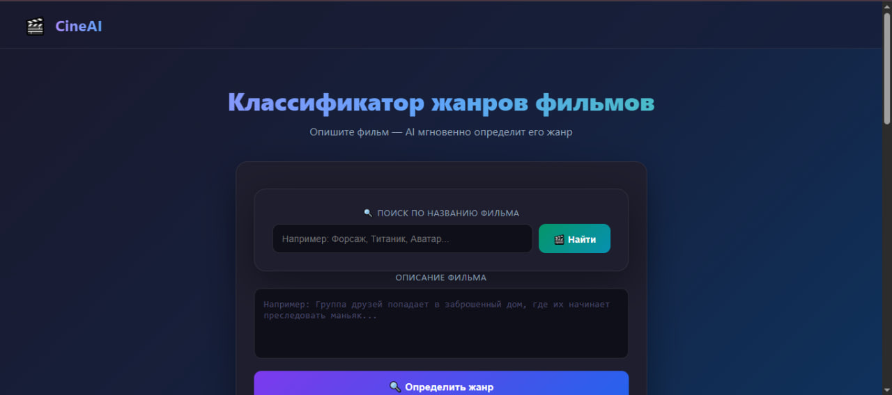
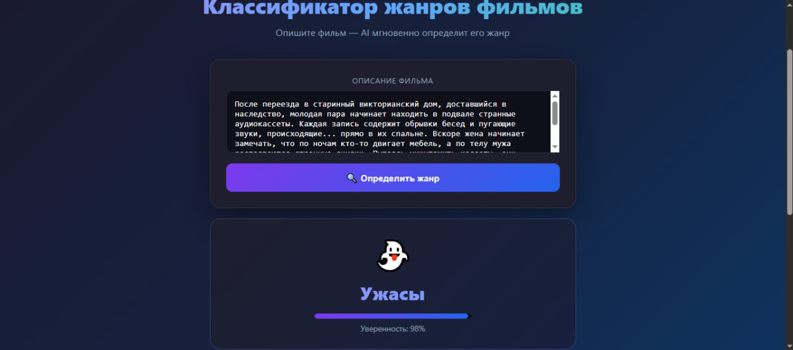
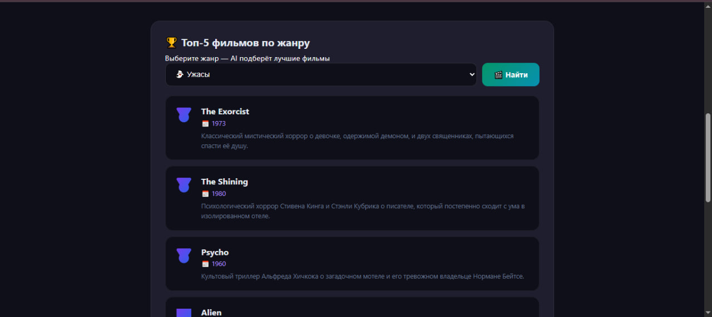
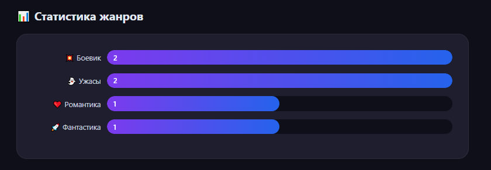
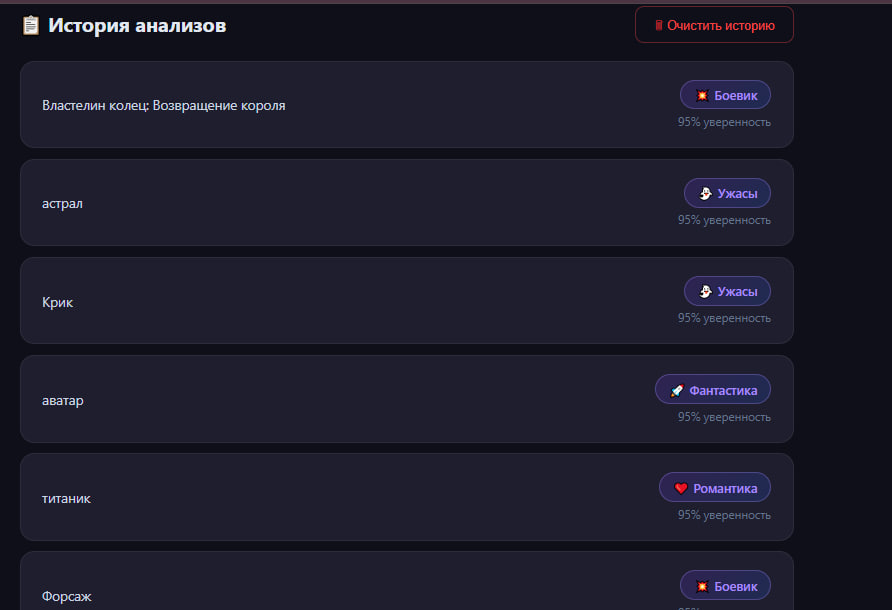

# 🎬 CineAI — Классификатор жанров фильмов

> AI-приложение для определения жанра фильма по описанию или названию



## ✨ Функционал

- 🔍 **Анализ по описанию** — введи описание фильма, AI определит жанр
- 🎬 **Поиск по названию** — введи название фильма
- 🏆 **Топ-5 фильмов** — AI подбирает лучшие фильмы по жанру
- 📊 **Статистика жанров** — график с количеством анализов
- 📋 **История анализов** — все результаты сохраняются в БД
- 🗑 **Очистка истории** — удаление всех записей

## 📸 Скриншоты

### Главная страница


### Результат анализа


### Топ-5 фильмов


### Статистика жанров


### История анализов


## 🛠 Стек технологий

| Слой | Технология |
|------|-----------|
| Frontend | HTML, CSS, JavaScript |
| Backend | ASP.NET Core Web API (C#) |
| AI | OpenRouter API |
| База данных | SQL Server + Entity Framework Core |

## 🚀 Запуск проекта

### 1. Клонировать репозиторий
\```bash
git clone https://github.com/Arlan-4ik/CinemaAi3.git
cd CinemaAi3/CineAI.API
\```

### 2. Настроить appsettings.json
\```json
{
  "ConnectionStrings": {
    "DefaultConnection": "Server=localhost;Database=CineAI;Trusted_Connection=True;TrustServerCertificate=True"
  },
  "HuggingFace": {
    "ApiKey": "ВАШ_КЛЮЧ_OPENROUTER"
  }
}
\```

### 3. Создать базу данных
\```bash
dotnet ef database update
\```

### 4. Запустить
\```bash
dotnet run
\```

### 5. Открыть в браузере
\```
http://localhost:5033/index.html
\```

## 📡 API Endpoints

| Метод | URL | Описание |
|-------|-----|----------|
| POST | /api/Analysis | Анализ по описанию |
| POST | /api/Analysis/search | Поиск по названию |
| POST | /api/Analysis/recommend | Топ-5 по жанру |
| GET | /api/Analysis | История анализов |
| GET | /api/Analysis/stats | Статистика жанров |
| DELETE | /api/Analysis/clear | Очистить историю |

## 👤 Автор

**Арлан** — студенческий AI проект
